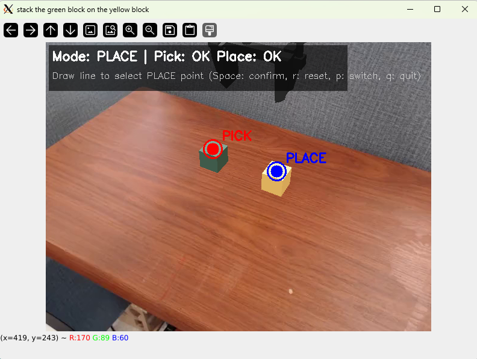
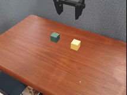

# Interactive Robotic Arm Trajectory Execution for SimplerEnv

An interactive robotic arm trajectory execution system based on Docker, supporting trajectory drawing through a visual interface and automatic execution. 
The project can be started with one command.

<div align="center">





</div>

## Overview

This project implements a complete workflow from visual interaction to automatic robotic arm execution. Users can draw trajectories on the image interface, and the system will automatically plan and execute corresponding robotic arm actions.

> 💡 **Tip**: Please ensure that Docker proxy and DISPLAY tunnel are properly configured before use.

---

## 📋 Prerequisites

1. **Docker** and **Docker Compose** installed
2. **NVIDIA Docker** support (for GPU acceleration)
3. **X11 display server** with DISPLAY tunnel configured (for displaying image windows)

## 🚀 Quick Start

### One-Command Run

```bash
# Set X11 permissions (first time use)
xhost +local:docker

# One-command run (will automatically build image on first run)
docker-compose up --build
```

### Run in Background

```bash
docker-compose up -d --build
```

## ⚙️ Configuration

### Environment Variables

You can configure runtime parameters through environment variables:

```bash
# Set environment variables
export ENV_NAME=StackGreenCubeOnYellowCubeBakedTexInScene-v0
export SCENE_NAME=bridge_table_1_v1
export ROBOT=widowx
export ROBOT_INIT_X=0.147
export ROBOT_INIT_Y=0.028
export OBS_CAMERA_NAME=3rd_view_camera
export MAX_EPISODE_STEPS=200
export LOGGING_DIR=/workspace/results
export DISPLAY=10.5.20.132:809

# Run
docker-compose up
```

### Configurable Parameters

- `ENV_NAME`: Environment name (default: `PutCarrotOnPlateInScene-v0`)
- `SCENE_NAME`: Scene name (default: `bridge_table_1_v1`)
- `ROBOT`: Robot name (default: `widowx`)
- `ROBOT_INIT_X`: Robot initial x coordinate (default: `0.147`)
- `ROBOT_INIT_Y`: Robot initial y coordinate (default: `0.028`)
- `OBS_CAMERA_NAME`: Observation camera name (default: `3rd_view_camera`)
- `MAX_EPISODE_STEPS`: Maximum steps (default: `200`)
- `LOGGING_DIR`: Logging directory (default: `/workspace/results`)
- `DISPLAY`: X11 display address (default: `10.5.20.132:809`)


## 🎮 Usage

1. **After starting the container**, an image window of the current scene will be displayed
2. **Draw lines on the image**:
   - Hold left mouse button and drag to draw a line
   - Press `Space` to confirm and start execution
   - Press `r` to clear and redraw
   - Press `q` to quit
3. **After execution completes**, videos will be saved to the `./results` directory

## 🛠️ Docker Compose Features

- ✅ **One-command run**: Start with `docker-compose up`
- ✅ **GPU support**: Automatically uses all available NVIDIA GPUs
- ✅ **X11 display**: Supports graphical interface display (for line drawing interaction)
- ✅ **Network mode**: Uses `host` mode for convenient network communication
- ✅ **IPC/PID sharing**: Supports shared memory and inter-process communication
- ✅ **Privileged mode**: Uses `privileged: true` for full permissions
- ✅ **Directory mounting**: Entire project directory mounted to container for real-time code modification

## 🔧 Common Commands

### Stop Container

```bash
# Stop and remove container
docker-compose down

# Stop and remove container and volumes
docker-compose down -v
```

### View Logs

```bash
# View real-time logs
docker-compose logs -f

# View recent logs
docker-compose logs --tail=100
```

### Enter Container for Debugging

```bash
# Enter running container
docker-compose exec simpler-env bash

# Or start a new interactive container
docker-compose run --rm simpler-env bash
```

### Rebuild Image

```bash
# Rebuild without cache
docker-compose build --no-cache

# Rebuild with cache
docker-compose build
```

## 📁 Result Files

After execution completes, result files will be saved in the `./results` directory:
- Execution video files (`.mp4` format)
- Screenshot files (`.png` format)


## ⚠️ Notes

1. **First run** requires building the image, which may take a long time (30-60 minutes)
2. **GPU memory**: Ensure sufficient GPU memory (recommended at least 8GB)
3. **X11 display**: Requires X11 server running, remote connections need DISPLAY tunnel setup
4. **Network**: If downloading models or data, ensure network connection is normal or configure proxy
5. **Directory mounting**: Entire project directory is mounted to container, code modifications don't require rebuilding image

## 🙏 Acknowledgments

We sincerely thank the following open-source projects and research works:

- [SimplerEnv-SOFAR](https://github.com/Zhangwenyao1/SimplerEnv-SOFAR)
- [ManiSkill2_real2sim](https://github.com/simpler-env/ManiSkill2_real2sim)
- [graspnetAPI](https://github.com/graspnet/graspnetAPI)
- [graspness_unofficial](https://github.com/graspnet/graspness_unofficial) / [graspnet-baseline](https://github.com/graspnet/graspnet-baseline)
- [MinkowskiEngine](https://github.com/NVIDIA/MinkowskiEngine)
- [pytorch3d](https://github.com/facebookresearch/pytorch3d)


